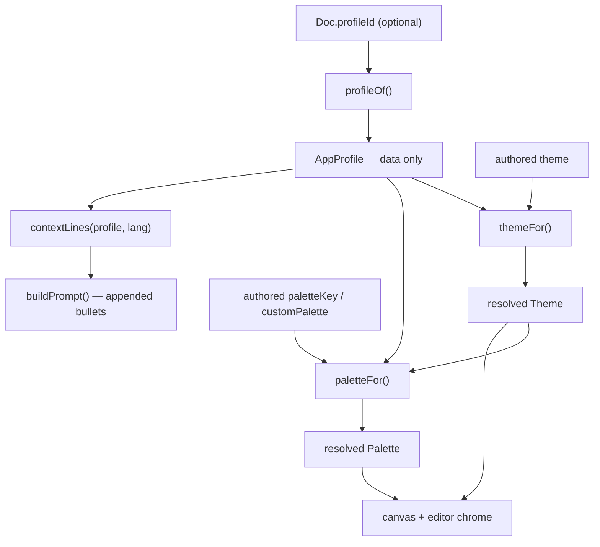

# App profiles

A small abstraction, added by this fork, for rendering and prompting a design under a chosen
design system.

## Upstream vs this fork

This repository is a fork of [lnkiai/m3e-canvas](https://github.com/lnkiai/m3e-canvas).

| Upstream M3E Canvas | This fork |
| --- | --- |
| Canvas, parts, screens, preview, layers, Tidy, share links, AI helper | unchanged |
| `Theme` and `Palette` in `lib/tokens.ts` | unchanged — profiles pick *values*, never new roles |
| `paletteOf()` | unchanged — still the path when no profile supplies a scheme |
| `buildPrompt()` and its four-language tables | unchanged, plus one appended loop |
| `Doc` | one optional field, `profileId` |
| — | `lib/profiles/` and `components/ProfileMenu.tsx` |

No backend, no MCP, no code generation. Three profiles ship: the identity, a fictional example, and
one derived from a public open-source project (see *Attribution*).

## Motivation

Upstream is Material 3 Expressive end to end: palette, theme axes and the prompt's closing
guidance all assume it. But a design is usually meant for *some particular* design system, and
saying which one should both make the canvas look like that system and make the generated prompt
say so in the implementer's terms. The constraint: adding a design system must be a data change,
with no per-system branch in the renderer, the resolvers or the prompt builder.

## Architecture

Authored state is what the author edits; resolved state is what the app draws and prompts with.
A profile is read over the authored state and never written back to it.



| File | Role |
| --- | --- |
| `lib/profiles/types.ts` | the `AppProfile` contract; declarations only |
| `lib/profiles/index.ts` | the registry and the four resolvers |
| `lib/profiles/fidelity.ts` | how faithful a profile's palette is, and the words for it |
| `lib/profiles/base.ts` · `demo.ts` · `nia.ts` | `BASE` (identity), `DEMO` (fictional), `NIA` (real-world) |
| `components/ProfileMenu.tsx` | the left-rail picker |
| `app/page.tsx` | holds `profileId`, resolves once per render |
| `lib/prompt.ts` | one import, one appended loop |
| `lib/tokens.ts` · `lib/project.ts` | `Doc.profileId?`, validated by shape |

## The AppProfile contract

```ts
export type AppProfile = {
  readonly id: string;               // stored in the document; never translated
  readonly label: string;            // shown as authored, not an i18n key
  readonly icon?: string;            // Material Symbols Rounded name
  readonly theme?: Partial<Theme>;   // only the axes this profile fixes
  readonly palette?: ProfilePalette; // { seed, label?, key? } | { palette: Palette }
  readonly context?: ProfileContext; // Partial<Record<Lang, readonly string[]>>
  readonly fidelity?: ProfileFidelity; // per mode: { level, note? }; unset means exact
};

export type Fidelity = "exact" | "mixed" | "generated";
export type ProfileFidelity = { readonly light?: ModeFidelity; readonly dark?: ModeFidelity };
export type ModeFidelity = { readonly level: Fidelity; readonly note?: ProfileContext };
```

Every optional field left unset means "leave the author's value alone". `BASE` sets none of them,
which is why it is the identity.

## Resolution behavior

Four pure functions in `lib/profiles/index.ts`. None branches on a profile's identity — that is
what makes a new profile a pure data change.

| Resolver | Behavior |
| --- | --- |
| `profileOf(id)` | Registry lookup. `undefined`, `null`, `""` and unknown ids all return `BASE`. |
| `themeFor(profile, authoredTheme)` | Normalises the authored theme, then overrides only the axes the profile sets (explicit `undefined` counts as unset). Always a fresh object; the authored theme is never mutated. |
| `paletteFor(profile, authoredScheme, resolvedTheme)` | See below. |
| `contextLines(profile, lang)` | The profile's lines for `lang`, else English, else the first language it defines, else `[]`. |
| `fidelityOf(profile, dark)` | That mode's standing: `exact`, `mixed` or `generated`. **`exact` when the profile states none**, so an unannotated profile is unchanged. |
| `fidelityNote(profile, dark, lang)` | The profile's own explanation for that mode, with the same language fallback. |
| `provenanceLines(profile, theme, lang)` | The caveat the prompt carries: one framing sentence plus the note, for each mode the prompt describes that is not exact. `[]` when every described mode is exact. |

| Profile's `palette` | `paletteFor` behavior |
| --- | --- |
| unset | calls upstream `paletteOf()` unchanged — the author's preset or seed |
| `{ seed }` | generates from the seed as an author's own seed is treated (muted seeds lifted to a usable accent) |
| `{ palette }` | uses the scheme as authored, as a preset is treated (hue and chroma preserved) |

For the latter two, the light standard scheme is used as given and dark / higher-contrast variants
are regenerated from the same seed. That regeneration **mirrors the tail of `paletteOf()` in
`lib/tokens.ts` and must be kept in step with it** — `paletteOf()` honours a supplied palette only
under the key `"custom"` and would otherwise discard a profile's colors.

`app/page.tsx` calls the first three once per render:

```ts
const profile = profileOf(profileId);
const renderTheme = themeFor(profile, theme);
const p = paletteFor(profile, { paletteKey, customPalette }, renderTheme);
setGlobalShape(renderTheme.shape);
```

`p` was already prop-drilled through the tree, so canvas *and* editor chrome follow the resolved
palette with no change to any component. Panels that *edit* the theme keep reading authored `theme`.

## profileId → prompt context

`Doc` carries `profileId?: string`, so it travels through project files, share links
(`shareable()` spreads the document) and localStorage with no change to `lib/share.ts`.
`buildPrompt()` resolves it at the point of use, as it already resolves `platform`:

```ts
for (const s of GENERAL[lang]) lines.push(`- ${typeof s === "function" ? s(platform) : s}`);
for (const s of contextLines(profileOf(doc.profileId), lang)) lines.push(`- ${s}`);
```

The lines append as bullets to the existing closing-guidance section — no new heading, no blank
line, no lead-in. A profile with nothing to say adds nothing, so a document naming no profile, one
naming `base`, and one naming a profile this build does not carry all produce byte-identical
prompts. `buildPrompt()` is also embedded in the AI helper's context (`lib/ai.ts`), so profile
guidance reaches the AI helper too; that is intended.

## The real-world profile, and what it cost

`NIA` maps [Now in Android](https://github.com/android/nowinandroid) (Apache-2.0) onto this
contract. It is worth reading as the honest measure of what the contract can and cannot hold.

| That project defines | Here |
| --- | --- |
| 19 light color roles, set by hand | mapped exactly |
| 6 further roles this `Palette` needs, which it never sets | **derived** from its `primary` as a seed by `schemeFromSeed`, at module load |
| 7 roles it sets that this `Palette` has no slot for (`tertiary`, `onSecondary`, `background`, `surfaceVariant`, …) | dropped |
| an authored dark scheme | **not represented** — dark is generated from the seed |
| a second colour scheme (a green "Android" variant) | not represented |
| a 15-style type scale | only the font family is representable; the weights go into `context` |
| `GradientColors`, `BackgroundTheme.tonalElevation`, `TintTheme` | `context` lines, not structured data |

The derivation matters: that project leaves those six roles to Compose's defaults, which come from
an unrelated baseline palette. Deriving them from its own `primary` keeps them inside its tonal
family and, unlike a hardcoded value, says plainly that they are generated rather than authored.
`nia.test.ts` asserts that every role in the resolved palette is either authored or derived, and
that the two sets together account for all of them.

### Attribution

`lib/profiles/nia.ts` carries the upstream copyright, licence and the exact commit its values were
read from. The repository's `NOTICE` records it alongside the project's other Apache-2.0 material.
Any further profile derived from someone else's work should do the same.

## Fidelity: saying what the values actually are

A profile's palette is not always its source's own. `fidelity` lets a profile say
so per mode, in three named states — `exact`, `mixed`, `generated`. There is no score
and no ordering; the states name what the values are, and the profile's `note` says why.

Two things read it, and neither knows about any particular profile:

- **The picker** shows a small note under the rows when the *active* profile is not exact in
  the mode currently on screen. The mode comes from the resolved theme in `ThemeContext`, so
  the same profile can read `mixed` in light and `generated` in dark. `info` marks `mixed`,
  `warning` marks `generated`.
- **The prompt** carries `provenanceLines` as bullets ahead of the profile's own guidance, so
  a coding agent is told which values are approximations before it is told what to build.
  The framing sentences live in `fidelity.ts`, keyed by state alone.

`NIA` states `light: "mixed"` (six roles derived) and `dark: "generated"` (the whole palette,
and not that project's authored dark scheme). A profile that says nothing is exact, so `BASE`
and `DEMO` are byte-identical to what they produced before fidelity existed — checked against
the previous implementation, not just through the suite.

## Adding a profile

1. Create `lib/profiles/<name>.ts`, setting only what the profile fixes:

   ```ts
   import type { AppProfile } from "./types";

   export const EXAMPLE: AppProfile = {
     id: "example",
     label: "Example System",
     theme: { shape: "square", font: "system" },
     palette: { seed: "#3B5BA5", label: "Example" },
     context: { en: ["Use the Example System's spacing scale: 4, 8, 16, 24."] },
   };
   ```

2. Register it in `lib/profiles/index.ts`: `import { EXAMPLE } from "./example";` and add it to
   `PROFILES`.
3. Run `npm test`. The registry tests iterate `PROFILES`, so a new profile is automatically checked
   for a unique id and for not mutating authored state.

The picker lists it, the canvas resolves it, the prompt picks up its context. Do not touch the
resolvers, `app/page.tsx`, `lib/prompt.ts` or `components/ProfileMenu.tsx`.

- `id` goes into saved documents — treat it as permanent; renaming one orphans existing files.
- `label` is shown untranslated by design (see *Limitations*); a full `Palette` must supply every
  role in the type, so a seed is usually easier.

## Invariants

Breaking one of these is how the abstraction turns into a pile of special cases.

1. **A profile is data** — the object carries no behaviour for a resolver to invoke, and no side
   effects. A profile file may compute its own literals at module load (`nia.ts` derives part of its
   palette with `schemeFromSeed`); what it may not do is hand the resolvers a function to call.
2. **No resolver names a profile.** `index.test.ts` pins this by resolving one not in the registry.
3. **Resolution is pure and one-way.** Profile then `BASE` again returns the author exactly where they were.
4. **`BASE` is the identity** — visually, and byte-for-byte in the prompt.
5. **No new prompt section.** The heading-equality test in `lib/prompt.test.ts` is the guard.
6. **`lib/profiles/` never imports `lib/prompt.ts`** — context is data keyed by language, not a function of `Doc`, which keeps the import graph acyclic.
7. **Profiles pick values, not roles.** The `Palette` roles and `Theme` axes are upstream's.
8. **Validation is shape-only** — any string `profileId` is accepted, so a file naming a profile from a later build still opens.

Tests: `lib/profiles/index.test.ts`, `components/ProfileMenu.test.tsx`, `lib/prompt.profile.test.ts`,
plus `profileId` cases in `lib/project.test.ts`.

## Current limitations

- **The color panel and a profile palette disagree.** When a profile supplies a scheme, the panel still shows the authored preset and changing it has no visible effect.
- **An edited prompt masks profile guidance.** With `promptEdit` set, `effectivePrompt()` returns that text verbatim. Upstream behaviour for every document change, not specific to profiles.
- **Profile labels and the picker tooltip are English only.** Keeping them out of `lib/i18n.ts` means adding a profile never touches the four-language dictionary or its parity test; the cost is an untranslated string in a four-language UI.
- **Profiles cannot change the component vocabulary.** `Kind`, `KIND_SPEC` and the renderer are Material 3 throughout; a profile changes theme, palette and prompt guidance only.
- **`resolveScheme()` mirrors `paletteOf()`'s tail** and can drift from it. The base-equivalence tests over every preset and theme are what catch that.
- **The prompt tests are equivalence tests**, so they cannot see a line added identically to both sides. The shape of the prompt's ending is pinned separately to cover that gap.
- **A profile can only supply a complete `Palette`, so missing roles must be derived.** A real design system rarely specifies all 25 roles this `Palette` needs; the rest are generated from its seed and are not that system's values. `nia.ts` documents which are which.
- **An authored dark scheme cannot be represented.** `palette` holds one light scheme and `resolveScheme` regenerates dark from its seed, so a design system's own dark colors are lost. `fidelity.dark` exists to declare this rather than to fix it.
- **Fidelity is declared, not computed.** Nothing verifies that a profile's stated level matches what it actually supplies; a profile can under- or over-state it. It is documentation the app surfaces, not a proof.
- **Typography is only partially representable.** `theme.font` carries a family and nothing else: no sizes, line heights, letter spacing or per-style weights.
- **Semantic tokens are prompt context, not structured data.** Gradients, tonal elevation, icon tints and anything else outside `Theme` and `Palette` can only be described in `context` lines, so the canvas cannot render them — only the generated prompt mentions them.

## Future exploration

Ideas only; none of this is implemented.

- Derive fidelity from the profile data instead of trusting the declaration, so a level cannot drift from what the profile really supplies.
- A partial palette overlay, so a profile can state only the roles its design system actually specifies and let the rest derive explicitly, instead of spreading a generated scheme by hand.
- A second authored palette for dark, so a design system's own dark colors survive.
- Reconcile the color panel with an overriding profile — show its scheme read-only, or offer to adopt it as the authored one.
- Surface in the prompt panel that an edited prompt is hiding profile guidance.
- A per-profile component vocabulary, so a profile offers the parts its design system has and hides the ones it does not. By far the largest step; would touch `Kind`, `KIND_SPEC` and the renderer.
- Profile-aware preview, so tapping through a design shows the profile's motion and shape.
- Author-defined profiles: import one as JSON, or derive one from exported design tokens.
- Translated profile labels, if the untranslated-string cost stops being acceptable.
- Let a profile contribute component-level notes, without introducing a prompt section of its own.
